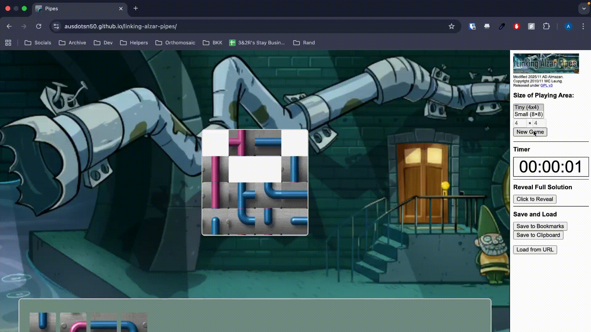

<!-- PROJECT DEMO -->
 

  

<h3 align="center">Linking Alzar Pipes</h3>

  

    Modification of an original web-based pipes game by <a href="https://github.com/lwchkg/pipesgame/">lwchkh/pipesgame</a>.
  

<!-- ABOUT THE PROJECT -->
## About The Project

In compliance with the CMSC 122: Data Structures and Algorithms I course, Linking Alzar Pipes was proposed as a modification to an original web-based pipes game by <a href="https://github.com/lwchkg/pipesgame/">lwchkg/pipesgame</a>. As a DSA course requirement, the main modifications required were in data structures and/or algorithms.

The gameplay centers around connecting pipe tiles to form a continuous network that allows water to flow seamlessly from start to end. Players must strategically determine pipe positioning to create a fully connected pipeline, avoiding loops or dead ends.

### Built With

* ![HTML][HTML]
* ![CSS][CSS]
* ![JavaScript][JavaScript]

<!-- GETTING STARTED -->
## Implemented Modifications
### Algorithm
> Pipes Maze Generation Algorithm - Prim's to Kruskal's

> Pipes Connection Checker Algorithm - Depth First Search to Breadth First Search 

## Gameplay Mechanics
When starting a new game, the playing area size is 4x4 by default, though a different configuration can be chosen. For this release version, the available sizes are 4x4 and 8x8. The timer, located on the right sidebar, starts as soon as the game begins. Additionally, the sidebar includes an option to reveal the full solution.

A random pipe maze is generated for each game. These pipes are guaranteed to be connected, as the generation uses Kruskal's algorithm to create a Minimum Spanning Tree.

Uniquely, not all pipe pieces are initially placed on the main board; some are located on the lower panel. These removed pieces retain the same orientation and pipe type as when the board was generated, but they are displaced from the grid. You cannot see their current rotation or appearance, adding a memory challenge to the game. For a 4x4 maze, 4 pieces are removed from the main board, while 8 pieces are removed for an 8x8 maze.

The goal is to strategically determine pipe positioning to create a fully connected pipeline, avoiding loops or dead ends.

## Deployment
https://ausdotsn50.github.io/linking-alzar-pipes/

<!-- LICENSE -->
## License

Distributed under the GNU General Public License. See `LICENSE` for more information.

<!-- CONTACT -->
## Contact
Angela Denise Almazan - azalmazan@up.edu.ph

<!-- Shields.io badges. You can a comprehensive list with many more badges at: https://github.com/inttter/md-badges -->
[HTML]: https://img.shields.io/badge/HTML-%23E34F26.svg?logo=html5&logoColor=white
[CSS]: https://img.shields.io/badge/CSS-639?logo=css&logoColor=fff
[JavaScript]: https://img.shields.io/badge/JavaScript-F7DF1E?logo=javascript&logoColor=000